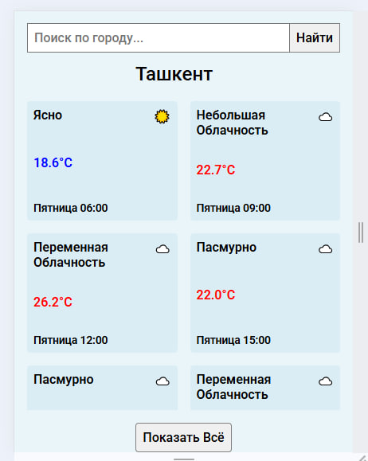
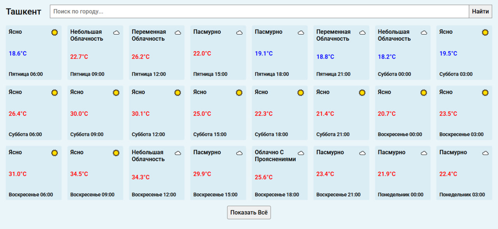

# Weather Dashboard 🌦️

A simple web application for viewing weather forecasts in cities around the world.  
It uses the **OpenWeatherMap API** and automatically detects the user's city by IP.  
The forecast is displayed in convenient cards with icons and temperature color highlights.

## 🚀 Features

- Detects current city by IP (via [ipwho.is](https://ipwho.is/))
- Search weather by any city
- Autocomplete suggestions from a predefined city list
- Detailed forecast with time intervals
- Displays:
  - Temperature
  - Weather description
  - Date and time
  - Weather icons (☀️ 🌧️ ❄️ 🌪️ etc.)
- Option to expand/collapse forecast list

## 🛠️ Tech Stack

- **HTML5** – structure
- **CSS3 (Flexbox, Grid, Media Queries)** – styling & responsiveness
- **Vanilla JavaScript (ES6+)**
- **OpenWeatherMap API** for weather data
- **ipwho.is API** for geolocation

## 📦 Installation & Usage

1. Clone the repository:
   ```bash
   git clone https://github.com/username/weather-dashboard.git

2. Navigate to the project folder:

`cd weather-dashboard

3. Open index.html in your browser.
⚠️ You need an OpenWeatherMap API key.
Replace the API_KEY value in js/script.js with your own key:

`const API_KEY = "YOUR_API_KEY";

## 📸 Screenshots

| Mobile | Desktop |
|--------|---------|
| | |


## 📜 License

Free to use for learning and personal projects.
